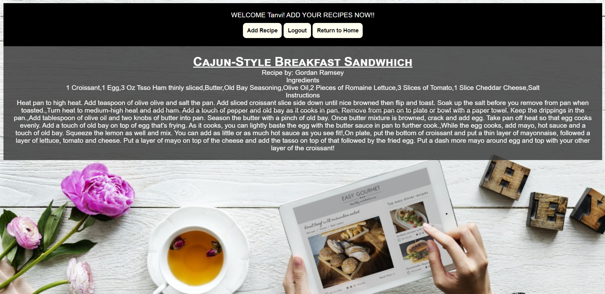

# Recipe Single-Page Web Application

## Steps to regenerate the project
* Clone the repository and open the `Recipe-App` directory
* Run your application with `npm install`, `npm start`
* The application will run on `http://localhost:3000/` in the browser

## Goal and Requirements

The application will be a single-page application. (which means only one page load!)  

From the main screen when a user loads the application:
* There is an option to login, but they are not required to login to view
* They can see a list of all recipe titles and their authors
* They can click a recipe title to see the recipe (author, title, ingredients, and instructions)
  * Do NOT use the recipe title as an identifier for the record, store an id with each recipe
* Logged in users can add a new recipe (title, ingredients, and instructions)
    * Hint: `<textarea>` is better for long blocks of text than `<input>`
    * Hint: The server must enforce that they are logged in to be able to add recipes
* When not on the main page, they can click something to return to the main page

* You must use 'express' as your node server library and `cookie-parser` middleware
* All services will be RESTful
* All services will return JSON data, not HTML
* All services must accept data as query params, in the path of the url, or as JSON data in the body
* You must use 'webpack' and 'babel-loader' to bundle the front end javascript (which must be at least two files)

### Home
* Displays a list of all stored recipes
* Offers the option to login or logout
  * this CAN be present on all pages, but MUST be present on the Home page
* Clicking on a recipe title (the visible text) will load a details page/screen
  * Hint: Remember to preventDefault on links
  * Hint: Remember to SHOW the title for any link, but not to use it as the link query parameter
* Clicking on the "New Recipe" button will to the New Recipe page/screen
  * This option is only shown for logged in users
* If a logged in user manually reloads the page, the page should show them as logged in
  * This should be done via a service call result, NOT by checking `document.cookies`
  
  

### Login Module
* They must provide a username to login
* No password
* username "dog" is treated as a bad login
* Show useful error messages if a login is denied

### Logout Module
* They will see the Home screen after logging out
* Another user can log in afterwards without requiring a new page load

### Recipe Details Module
* Displays the author, title, ingredients list, and instructions for the selected recipe
* You can click a "Return to Home" link to return to the Home Page

### New Recipe Module
* Displays a form to enter the title, ingredients list, and instructions for a new recipe
* The ingredients list is a single textarea field to enter the data
* The instructions list a single textarea field to enter the data
* The user is not allowed to enter a recipe without something present in all 3 fields
* The user can click a "Return to Home" link to return to the Home Page
* The user is put on the Recipe Details screen for the new recipe after successfully submitting a recipe.

### REST Services
* You will need to add REST services to fulfill the needs of the application
* Pick services data, methods, URLs, and status codes to match the requirements of RESTful services as described in class
* Any request/response bodies will be in JSON (if they are present)
* Store the author (username) of a new recipe, along with any created id for that recipe

### Persistence
* There is no particular persistence requirement: the data need only persist as long as the server is running
* If you restart the server, the data is lost
* You may pre-populate some recipes if you wish

## Allowances
* You may create your HTML as you see fit, but it must be fundamentally semantically valid and other best practices from class
* You may create the CSS as you see fit but you must follow the best practices given in class
* You may add icons and background images but there is no requirement to do so
* You may use `express`, `cookie-parser`, `uuid`, and any other modules that have been used in class

