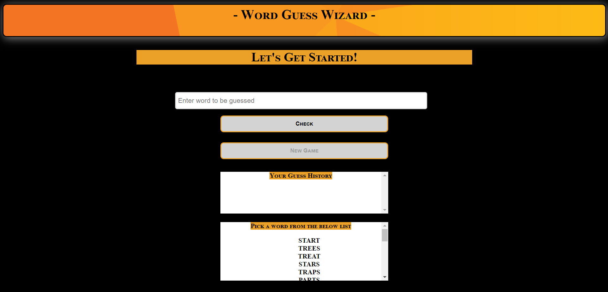
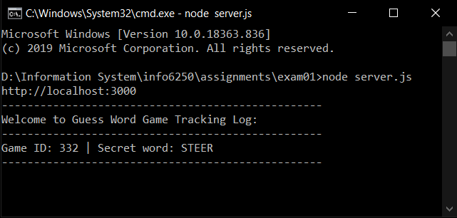

 ## Goal and Requirements

The application is a game to guess a word.

The User will enter a word, and the page will do one of:
* Say the word is not one of the permitted words and allow them to enter a new word
* Display that the user has correctly guessed the word and allow them to start a new game
* Say how many letters the word has in common with the word they are trying to guess, without regard to position or case-sensitivity  (See "Examples" below)

## Requirements

### Visuals
* The game will display the list of previously guessed words for this word, as well as their number of "matching" letters
* The game will display the number of accepted guesses made (turns taken, not counting invalid words)
* The game will display the list of valid words to guess
  * This list will be scrollable if it cannot fit in the space available
* The game will show effort to make it visually attractive and usable.

       

### Logic
* The game will use a `words.js` that exports an array of valid words.

 `const wordList = [ 'START', 'TREES', 'TREAT', 'STARS', 'TRAPS', 'PARTS',
    'STRAP', 'STARK', 'CARTS', 'SPREE', 'TARPS', 'TARTS',
    'CRASH', 'TRASH', 'SHARP', 'HARPS', 'CRUSH', 'RUSTS',
    'RESTS', 'STEER', 'STARE', 'TRACK', 'THESE', 'TRUCK' ]`
    
`module.exports = wordList;`

* The game will work if this file is replaced by a different list of words.  All words in any version of the file will be the same length as the other words in that file.
* The words.js file should ONLY export an array of valid words
  * ONLY.  Any other word logic should be in a different file.
* The game will not care about case-sensitivity.  The game will call a letter a match, even if the letter is in a different position in the word (see "Examples" below)

 `function compare( word, guess ) {  
    let match = 0;
    const letterCount = {};

    for( let letter of word.toLowerCase() ) {
        letterCount[letter] = letterCount + 1 || 1;
    }
    for( let letter of guess.toLowerCase() ) {
        if( letterCount[letter] ) {
            letterCount[letter] -= 1;
            match += 1;
        }
    }
    return match;
}`

* The server will console.log the current secret word at the start of a game with a given game id.  The client should never know the secret word until it is guessed. 

        

  * Hint: the server should send a random id to the client.  The server will be able to match the id to a word, but the client should not be able to.
  * Hint: The page will have to send this same secret id to the server on every request. This can be done with a hidden input field or a query parameter.
* The game must be runnable via: `npm install` and then `node server.js` and then going to `http://localhost:3000`
* The server should work for multiple players, each playing their own games that may last different durations and are not impacted by other players.  
  * Hint: The random ids are how the servers tell the players apart - the id will have to be sent on each request.
* No information should be sent to the clients that allow them to learn the secret words they are trying to guess outside of guessing.
  * Hint: This means the secret word isn't sent to the browser

### Examples

If `words.js` has the words "TEA, EAT, TEE, PEA, PET, APE" and the game selects TEA as the secret word then:
* TREE will give a warning about an invalid word, not increment the turn counter and allow a new guess
* ATE will give a warning about an invalid word, not increment the turn counter and allow a new guess
* PET will respond with 2 matches and increment the turn counter then allow a new guess
* TEE will respond with 2 matches and increment the turn counter then allow a new guess
* tee will respond with 2 matches and increment the turn counter then allow a new guess
* EAT will respond with 3 matches and increment the turn counter then allow a new guess
* TEA will respond that they have won the game in however many turns and allow them to start a new game with a new randomly selected word from the list

## Steps to Regenerate this project
 
 * Download the repository
 * Go to `Word Guessing Game` folder
 * Run `npm install` and the application will be ready to use
 * Run `node server.js` which will begin the server
 * Open 'http://localhost:3000' in browser

